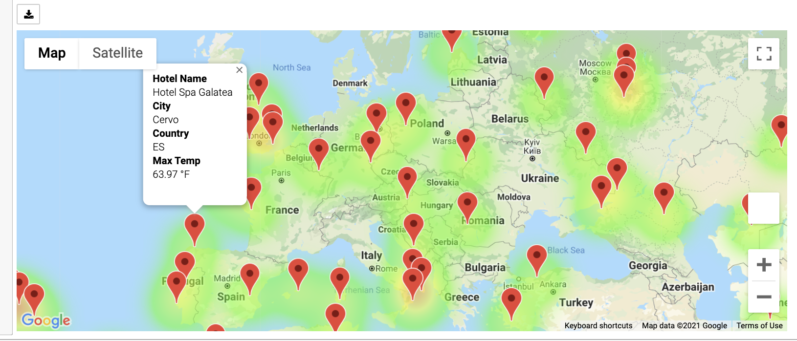
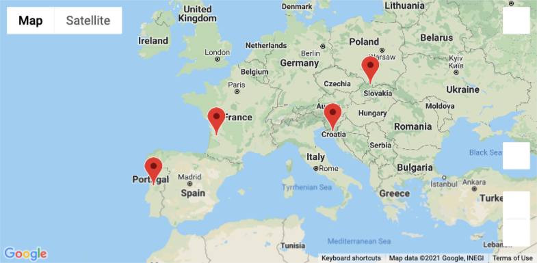
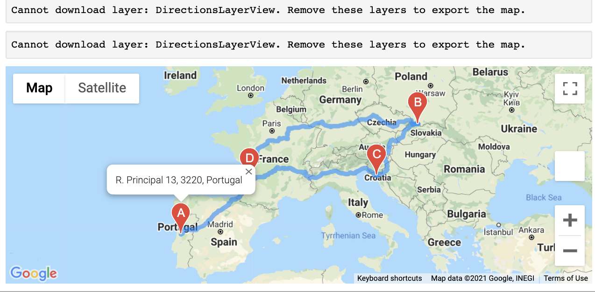

# World_Weather_Analysis
World_Weather_Analysis

## Overview:

Jack from the PlanmyTrip App wants to take the app to the next level. Jack recommends we add Weather description to our dataset. Jack also wants Beta-testing done by allowing testers to input, and filter our data to meet their weather preferences we will output all locations that meet their weather preference. Once their output location is finalized, Jack wants to view nearby hotels in that location. Finally Jack wants the ability to create routes, a beta tester will choose 4 cities at random for me to map. Finally using the google direction API, Jack wants to see a clearly established route to travel between all 4 cities. 

## Weather Database:
This folder holds the Open Weather API to extract 520+ cities from google maps API transformed into a Dataframe for the cities that specifically contain information about

* Current Weather Description
* Max Temp
* Wind speed
* Cloudiness
* Humidity 

By extracting these specific columns we make it simpler for travelers to be able to choose climate conditions that meet their travel expectations. 

## Vacation Search:

The Vacation search folder takes the data from google API and plots travel locations as well as one nearby hotel. 
In the screenshot example below we are requesting for locations in the database that have a daily maximum temperature between 60 to 80 degrees. In module 6 we created a heatmap to be able to filter for max temp degrees. Please note each bubble is interactive and will show Hotels as well. 
 

## Vacation Itinerary:

The Vacation Itinerary folder takes our search information from the google maps directions. We have choosen these 4 european cities, Lata, Libourne, Namestovo, and Zlobin as our intended travel destinations

 

By using the google maps directions API, we are able to create this useful map clearly showing us which route to follow. 

